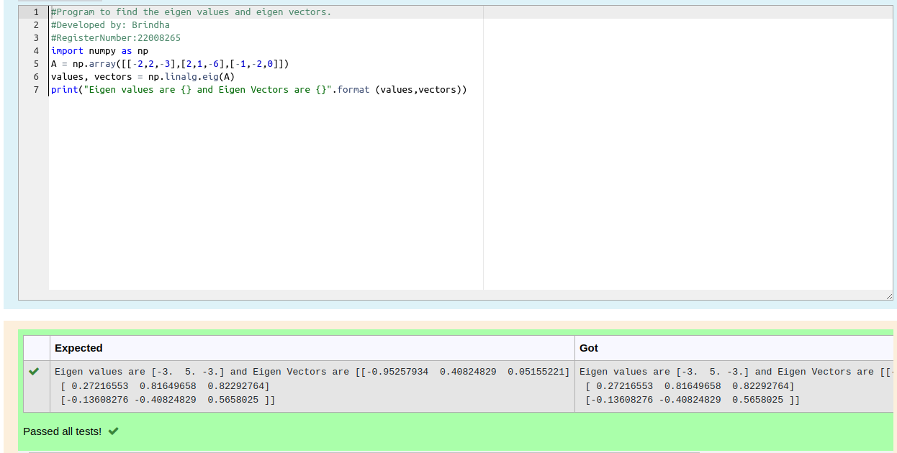

# EIGENVALUES-AND-EIGENVECTORS
## Aim:
To write a python program to find the Eigenvalues and Eigen Vectors

## Equipment’s required:
1. 	Hardware – PCs
2. 	Anaconda – Python 3.7 Installation / Moodle-Code Runner

## Algorithm:
Step1 : 
Get the two values from the user

Step 2: Assign the value of second variable to a temporary variable

Step 3: Using the np.linalg.eig(),  we get two results (first is eigenvalue and second is eigenvector) of the given matrix.

Step 4: Assign the value in temporary variable to the first variable

Step 5:Print both the values it would be interchanged

Step 6:End the program

## Program:
```python
#Program to find the eigen values and eigen vectors.
#Developed by: Brindha
#RegisterNumber:22008265
import numpy as np
A = np.array([[-2,2,-3],[2,1,-6],[-1,-2,0]])
values, vectors = np.linalg.eig(A)
print("Eigen values are {} and Eigen Vectors are {}".format (values,vectors))
```

## Output:


## Result:
Thus the Eigenvalue and Eigenvector is successfully solved using python program
